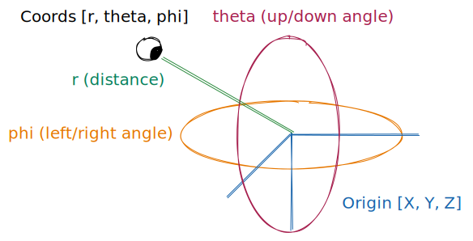

# r3f-simple-orbit-camera

This is a simple orbit camera for react-three-fiber.
It is slower than [r3f-orbit-camera](https://github.com/garbo-succus/r3f-orbit-camera). 



```js
import SimpleOrbitCamera from 'r3f-simple-orbit-camera'

const App = () => {
  const [origin, setOrigin] = useState([0, 0, 0])
  // origin: [x, y, z], // world target
  const [coords, setCoords] = useState([0, 0, 0])
  // coords: [
  //   r, // Distance to origin
  //   theta, // Polar (up-down) angle
  //   phi // Azimuthal (left-right) angle
  // ]
  return (
    <Canvas>
      <SimpleOrbitCamera origin={origin} coords={coords} />
    </Canvas>
  )
}

```

If you wish to animate transitions, consider [react-spring](https://github.com/pmndrs/react-spring).
